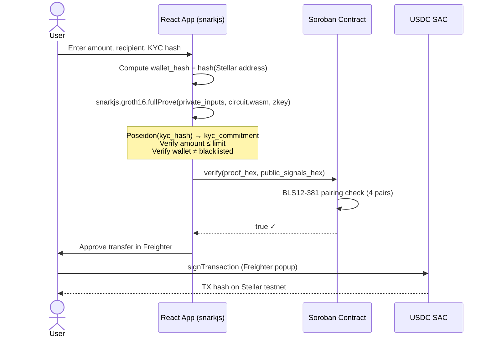

<div align="center">

```
 ██╗  ██╗ █████╗  ██████╗ ███████╗
 ██║ ██╔╝██╔══██╗██╔════╝ ██╔════╝
 █████╔╝ ███████║██║  ███╗█████╗
 ██╔═██╗ ██╔══██║██║   ██║██╔══╝
 ██║  ██╗██║  ██║╚██████╔╝███████╗
 ╚═╝  ╚═╝╚═╝  ╚═╝ ╚═════╝ ╚══════╝
```

### Privacy-Preserving Remittances · KYC + AML On-Chain Without Revealing Your Identity

[](https://developers.stellar.org/)
[](https://docs.circom.io/)
[](https://eprint.iacr.org/2016/260)
[](https://hackmd.io/@benjaminion/bls12-381)
[](https://www.rust-lang.org/)
[](https://react.dev/)
[](LICENSE)

</div>

---

## What is KAGE?

**KAGE** is a zero-knowledge proof system for private cross-border remittances built on **Stellar Soroban**. It lets a user prove they are KYC-compliant, AML-compliant, and not on a sanctions list — **without revealing their identity, exact amount, or any private data** — and then gate a real USDC transfer behind that cryptographic proof.

The proof is generated entirely **in the browser** using snarkjs and verified **on-chain** by a Soroban smart contract performing native BLS12-381 pairing checks.

> *Prove you're compliant. Not who you are.*

---

## Core Claims Proven by the ZK Circuit

| Claim | What the circuit proves | What stays private |
|---|---|---|
| **KYC Valid** | `Poseidon(kyc_hash) == kyc_commitment` published on-chain | Raw KYC document identifier |
| **AML Compliant** | `amount <= amount_limit` (regulator ceiling) | Exact transfer amount |
| **Not Blacklisted** | `wallet_hash != blacklisted_value` | Sender's real wallet address |

The verifier on Soroban sees only the **public outputs** (the KYC commitment hash, the AML ceiling, and the blacklist anchor). Nothing else leaks.

---

## Architecture

```
┌─────────────────────────────────────────────────────────────────────┐
│                         USER'S BROWSER                              │
│                                                                     │
│  ┌─────────────┐    private inputs     ┌──────────────────────┐    │
│  │  React UI   │ ──────────────────>  │   snarkjs (WASM)     │    │
│  │  (Vite)     │   kyc_hash           │   Groth16 Prover     │    │
│  │             │   amount             │                      │    │
│  │  Freighter  │   wallet_hash        │  zkremit.circom      │    │
│  │  Wallet     │                      │  + BLS12-381 field   │    │
│  └─────────────┘                      └──────────┬───────────┘    │
│                                                   │ proof + public │
│                                                   │ signals (hex)  │
└───────────────────────────────────────────────────┼────────────────┘
                                                    │
                                                    ▼
┌─────────────────────────────────────────────────────────────────────┐
│                      STELLAR TESTNET                                │
│                                                                     │
│  ┌─────────────────────────────────────────────────┐               │
│  │         Soroban Smart Contract (Rust)           │               │
│  │                                                 │               │
│  │  fn verify(proof_bytes, pub_signals_bytes)      │               │
│  │    → BLS12-381 pairing check (4 pairings)       │               │
│  │    → returns true / false                       │               │
│  └──────────────────────────┬──────────────────────┘               │
│                             │ verified == true                     │
│                             ▼                                       │
│  ┌─────────────────────────────────────────────────┐               │
│  │         USDC SAC Transfer                       │               │
│  │  transfer(from, to, amount) via Freighter sign  │               │
│  └─────────────────────────────────────────────────┘               │
└─────────────────────────────────────────────────────────────────────┘
```

---

## End-to-End Flow



---

## ZK Circuit — `zkremit.circom`

```
circuits/zkremit.circom
│
├── Private Inputs (never leave the prover)
│   ├── kyc_hash        ← secret KYC document identifier
│   ├── amount          ← transfer amount (micro-USDC)
│   └── wallet_hash     ← numeric hash of Stellar G... address
│
├── Public Inputs (known to on-chain verifier)
│   ├── amount_limit    ← AML per-transfer ceiling
│   └── blacklisted     ← blocked wallet hash (MOCK)
│
└── Public Output (revealed by proof)
    └── kyc_commitment  ← Poseidon(kyc_hash)

Constraints:  ~486
Curve:        BLS12-381  (required for Soroban native pairing)
Hash:         Poseidon   (ZK-friendly, circomlib)
Comparator:   LessEqThan(64) + IsEqual  (circomlib)
```

---

## Soroban Verifier Contract

The Soroban contract is a **generic Groth16 verifier** written in Rust with no external crypto dependencies — it uses the **native BLS12-381 host functions** built into the Soroban runtime:

```rust
// Core verification — 4 BLS12-381 pairings
let neg_a = -proof.a;
let vp1 = vec![env, neg_a, vk.alpha, vk_x, proof.c];
let vp2 = vec![env, proof.b, vk.beta, vk.gamma, vk.delta];
Ok(bls.pairing_check(vp1, vp2))
```

**Contract API:**

| Function | Description |
|---|---|
| `set_vk(vk_bytes)` | Store the Groth16 verification key on-chain (validates on upload) |
| `verify(proof_bytes, pub_signals_bytes)` | Verify a Groth16 proof, returns `bool` |

The contract is **circuit-agnostic** — it works for any Circom circuit compiled to BLS12-381, regardless of how many public signals it has.

---

## Tech Stack

<div align="center">

| Layer | Technology | Role |
|---|---|---|
| **ZK Circuit** | [Circom 2.0](https://docs.circom.io/) + BLS12-381 | Constraint system for private remittance compliance |
| **ZK Gadgets** | [circomlib](https://github.com/iden3/circomlib) | Poseidon hash, LessEqThan, IsEqual |
| **Proving System** | [Groth16](https://eprint.iacr.org/2016/260) | Succinct non-interactive proofs (zkSNARK) |
| **In-Browser Prover** | [snarkjs](https://github.com/iden3/snarkjs) (WASM) | Full proof generation client-side |
| **Trusted Setup** | Powers of Tau + Phase 2 (BLS12-381) | Ceremony artifacts for circuit |
| **Smart Contract** | [Soroban](https://developers.stellar.org/docs/build/smart-contracts) (Rust) | On-chain Groth16 verifier |
| **Elliptic Curve** | [BLS12-381](https://hackmd.io/@benjaminion/bls12-381) | Native Soroban host pairing functions |
| **Blockchain** | [Stellar](https://stellar.org/) Testnet | Transaction settlement |
| **Stablecoin** | [USDC](https://www.circle.com/en/usdc-multichain/stellar) (SAC) | Transfer token gated by ZK proof |
| **Wallet** | [Freighter](https://www.freighter.app/) | Browser extension for Stellar signing |
| **Frontend** | [React](https://react.dev/) + [Vite](https://vitejs.dev/) | UI for proof generation and verification |
| **Serialization** | Custom Rust CLI (`circom-to-soroban-hex`) | JSON proof → Soroban byte encoding |

</div>

---

## Repository Layout

```
kage/
├── circuits/
│   └── zkremit.circom          ← ZK circuit: KYC + AML + blacklist checks
│
├── contract/
│   └── src/lib.rs              ← Soroban Groth16 verifier (Rust, no_std)
│
├── tools/
│   └── circom_to_soroban_hex/  ← CLI: snarkjs JSON → Soroban byte payloads
│       └── src/main.rs
│
├── frontend/
│   ├── src/App.jsx             ← Main UI: proof gen + Freighter + USDC transfer
│   ├── src/lib/snarkHex.js     ← Proof serialization for Soroban
│   ├── src/lib/stellarVerify.js← Soroban contract invocation
│   └── src/lib/usdcTransfer.js ← USDC SAC transfer via Freighter
│
├── proving/
│   ├── input_zkremit.json      ← Sample private inputs
│   └── zkremit_final.zkey      ← Circuit-specific proving key
│
├── build/                      ← Generated artifacts (safe to regenerate)
│   ├── proof.json
│   ├── public.json
│   └── verification_key.json
│
└── demo.sh                     ← One-command full on-chain demo
```

---

## Quickstart

### Prerequisites

```bash
# Rust toolchain
rustup target add wasm32v1-none

# Circom
npm install -g circom

# Stellar CLI (with a funded testnet identity called 'myaccount')
stellar keys generate myaccount --network testnet
stellar keys fund myaccount --network testnet
```

### Full On-Chain Demo (one command)

```bash
./demo.sh
```

What it does under the hood:

```
 1. Install Node deps (snarkjs, circomlib)
 2. Build Soroban contract WASM
 3. Compile zkremit.circom (BLS12-381 field)
 4. Generate Powers of Tau (cached after first run)
 5. Phase 2 trusted setup → zkremit_final.zkey
 6. Generate witness from sample inputs
 7. Deploy verifier contract to Stellar Testnet
 8. Generate Groth16 proof (proof.json + public.json)
 9. Verify locally with snarkjs
10. Encode VK + proof + public signals → Soroban hex
11. set_vk(...) on-chain
12. verify(...) on-chain → true ✓
13. Copy circuit artifacts to frontend/public/
```

Expected output:
```
Contract ID: C...
✓ snarkjs local verification passed
On-chain verification result: true
```

### Frontend

```bash
cd frontend
cp .env.example .env
# Edit .env with your contract ID and keys
# (generate keys at https://lab.stellar.org and fund with Friendbot)
npm install
npm run dev
```

Then open `http://localhost:5173`, connect Freighter, and generate your first ZK proof in the browser.

---

## How the ZK Proof Works

A Groth16 proof is a tuple of three elliptic curve points `(A, B, C)` on BLS12-381:

```
A ∈ G1,   B ∈ G2,   C ∈ G1
```

The Soroban verifier checks the following pairing equation holds:

```
e(-A, B) · e(α, β) · e(vk_x, γ) · e(C, δ) = 1
```

Where `vk_x` is computed from the public signals and the IC (Input Commitment) points in the verification key. If this equation holds, the prover **must** know private inputs satisfying all the circuit constraints — without those inputs ever being transmitted.

---

## Public Signals Revealed by the Proof

```json
[
  "kyc_commitment",   // Poseidon(kyc_hash) — verifier cross-checks KYC registry
  "amount_limit",     // AML ceiling used in the proof
  "blacklisted"       // Blocked wallet hash used in the proof (MOCK)
]
```

The **exact amount and real KYC identity remain private** — the verifier only learns the amount was within bounds and the user passes KYC.

---

## Useful Commands

```bash
# Workspace checks
cargo check --workspace
cargo test --workspace

# Manual encoding (after running demo.sh)
cargo run -p circom-to-soroban-hex -- vk    build/verification_key.json
cargo run -p circom-to-soroban-hex -- proof  build/proof.json
cargo run -p circom-to-soroban-hex -- public build/public.json

# Frontend production build
cd frontend && npm run build
```

---

## Security & Production Notes

| Item | Status | Production Path |
|---|---|---|
| Trusted setup entropy | Mock (single contributor) | Multi-party Powers of Tau ceremony |
| Blacklist check | Single-value equality check | Merkle non-membership proof against `blacklist_root` |
| KYC commitment | Simulated numeric hash | KYC provider signs and publishes `Poseidon(kyc_hash)` |
| Contract audit | Unaudited | Full security audit required before mainnet |

---

## Resources

- [Stellar Soroban Docs](https://developers.stellar.org/docs/build/smart-contracts)
- [Circom Documentation](https://docs.circom.io/)
- [snarkjs](https://github.com/iden3/snarkjs)
- [BLS12-381 For The Rest Of Us](https://hackmd.io/@benjaminion/bls12-381)
- [Groth16 Paper](https://eprint.iacr.org/2016/260)
- [circomlib Gadgets](https://github.com/iden3/circomlib)
- [Freighter Wallet](https://www.freighter.app/)

---

## Disclaimer

This project is **experimental** and was built for demonstration and hackathon purposes. It has **not been audited**. Do not use in production without a full security review and a proper trusted setup ceremony.

---

<div align="center">

**MIT License** · Built with zero-knowledge, deployed on Stellar

</div>
